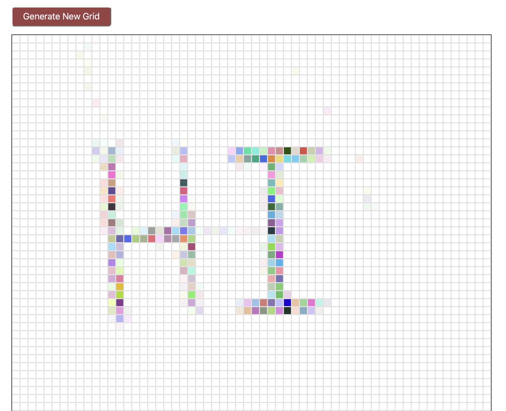

# Etch-A-Sketch

Create a colorful drawing with this Etch-A-Sketch style webpage.

## Description

This project is a simple Etch-A-Sketch application built with HTML, CSS, and JavaScript. It allows users to generate a grid of randomly-colored squares that darken on hover, and provides a button to reset the grid with a new size.

## Screenshot



## Table of Contents

- [Description](#description)
- [Screenshot](#screenshot)
- [Features](#features)
- [Installation](#installation)
- [Usage](#usage)
- [Tech Stack](#tech-stack)
- [License](#license)
- [Contact Information](#contact-information)

## Features

- Generate a customizable grid of squares.
- Squares have randonly generated background colors.
- Incrementally darkens the background color of each square on hover.
- Change the grid resolution interactively.

## Installation

1. Clone the repository:
   ```sh
   git clone https://github.com/sourdoughbredd/etch-a-sketch.git
   ```
2. Navigate to the project directory:
   ```sh
   cd etch-a-sketch
   ```
3. Open `index.html` in your preferred web browser.

## Usage

- Open `index.html` in a web browser.
- Use the mouse to hover over the grid cells to change their background color.
- Click the "Generate New Grid" button to prompt for a new grid size and generate a new grid.

## Tech Stack

- HTML
- CSS
- JavaScript

## License

This project is licensed under the MIT License.

## Contact Information

For any questions or suggestions, please contact [Brett Bussell](mailto:bwbussell24@gmail.com).
